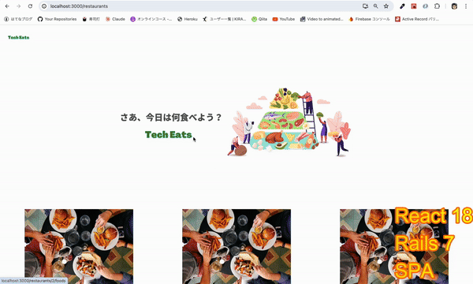

# techeats-uber-ruby-back

TechEats - Japanese UberEats clone | Rails7 Backend

## Prerequisites

- Rails 7

```yaml
ruby: 3.2.1
rails: 7.1.3
```

## Getting Started

```bash
$ rails -s
```



&copy; 2025 All Rights Reserved.
